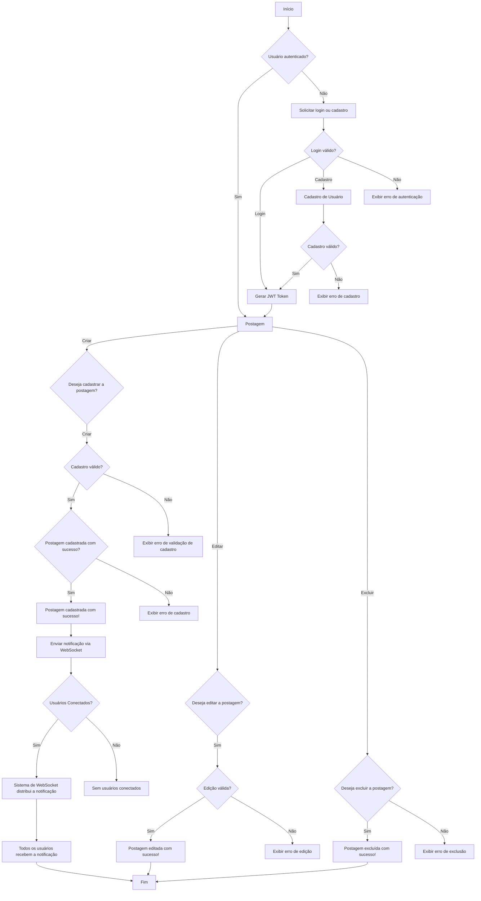
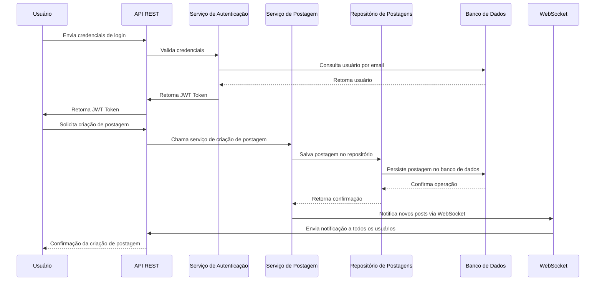
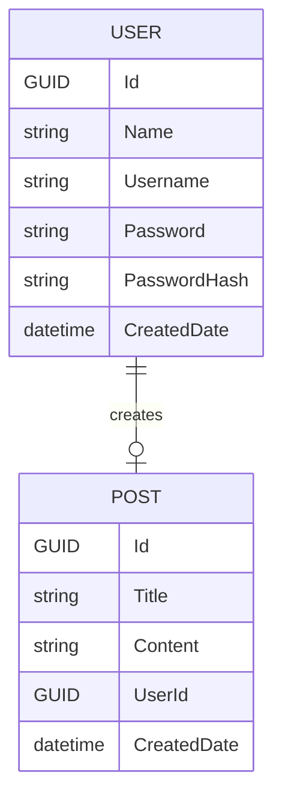

# Blog App API

- [Blog App API](#blog-app-api)
  - [Introdução](#introdução)
  - [Fluxo](#fluxo)
    - [1. **Login de Usuário**](#1-login-de-usuário)
    - [2. **Criação de Postagem**](#2-criação-de-postagem)
    - [3. **Notificação em Tempo Real via WebSocket**](#3-notificação-em-tempo-real-via-websocket)
    - [Diagrama de Fluxo de Dados](#diagrama-de-fluxo-de-dados)
    - [Diagrama de Sequência](#diagrama-de-sequência)
  - [Diagrama de Entidades (ER Diagram)](#diagrama-de-entidades-er-diagram)
  - [Como Testar a Aplicação Localmente](#como-testar-a-aplicação-localmente)
    - [1. **Configuração Inicial**](#1-configuração-inicial)
      - [Passos para configurar e rodar a aplicação localmente:](#passos-para-configurar-e-rodar-a-aplicação-localmente)
    - [2. **Testes de Funcionalidade (Manuais)**](#2-testes-de-funcionalidade-manuais)
      - [2.1 **Teste de Login**](#21-teste-de-login)
      - [2.2 **Teste de Criação de Postagem**](#22-teste-de-criação-de-postagem)
      - [2.3 **Teste de Notificação via WebSocket**](#23-teste-de-notificação-via-websocket)
      - [2.4 **Teste de Exclusão de Postagem**](#24-teste-de-exclusão-de-postagem)
    - [Conclusão](#conclusão)


## Introdução
O **Blog App API** é um serviço REST básico de blog que permite aos usuários autenticados visualizar, criar, editar e excluir postagens. Além disso, qualquer visitante do site pode visualizar as postagens existentes. O sistema implementa autenticação baseada em **JWT** (JSON Web Token) para garantir a segurança e a privacidade dos dados, enquanto o **Entity Framework** é utilizado para persistir os dados no banco de dados.

Este sistema também inclui um mecanismo de **notificação em tempo real** usando **WebSockets**, que permite que os usuários conectados sejam notificados imediatamente sempre que uma nova postagem for criada. A arquitetura do sistema segue os princípios de **Arquitetura Hexagonal**, **SOLID**, e **Domínio Rico**, com foco na separação clara de responsabilidades e na extensibilidade do código.

## Fluxo
O fluxo de dados descreve a interação entre o **Usuário**, a **API REST**, os **Serviços**, o **Banco de Dados**, e o sistema de **Notificação em Tempo Real** usando **WebSockets**.

### 1. **Login de Usuário**

- O **Usuário** envia suas credenciais (usuário e senha) através de uma requisição para a **API REST**.
- A **API REST** então direciona a requisição para o **Serviço de Autenticação**, responsável por validar as credenciais.
- O **Serviço de Autenticação** valida as credenciais comparando com os dados armazenados no **Banco de Dados**.
- Se as credenciais forem válidas:
  - O **Serviço de Autenticação** gera um **JWT Token**.
- O **JWT Token** é enviado de volta para a **API REST**.
- A **API REST** retorna o **JWT Token** para o **Usuário**.

### 2. **Criação de Postagem**

- Após o login, o **Usuário** envia uma solicitação para criar uma postagem (incluindo título e conteúdo).
- A **API REST** encaminha a solicitação para o **Serviço de Postagem**.
- O **Serviço de Postagem** interage com o **Repositório de Postagens** para armazenar a nova postagem no **Banco de Dados**.
- Após a persistência da postagem:
  - O **Serviço de Postagem** utiliza o **WebSocket** para notificar todos os usuários conectados sobre a nova postagem.
- A **API REST** retorna uma confirmação para o **Usuário** informando que a postagem foi criada com sucesso.

### 3. **Notificação em Tempo Real via WebSocket**

- Quando uma nova postagem é criada, o **Serviço de Postagem** envia uma notificação via **WebSocket** a todos os **Usuários Conectados**.
- O sistema de **WebSocket** distribui a notificação em tempo real para os usuários que estão ouvindo o canal de notificações.
- Todos os **Usuários Conectados** recebem imediatamente a notificação sobre a nova postagem.


### Diagrama de Fluxo de Dados



### Diagrama de Sequência


## Diagrama de Entidades (ER Diagram)

O diagrama de entidades (ER) mostra as principais entidades e suas relações dentro da aplicação de blog, bem como os atributos essenciais de cada entidade.



## Como Testar a Aplicação Localmente

Para testar a aplicação localmente, é necessário configurar o ambiente de desenvolvimento e realizar uma série de testes para garantir que o sistema esteja funcionando corretamente. A seguir, detalho os passos para configurar e testar a aplicação localmente.

### 1. **Configuração Inicial**

Antes de realizar qualquer tipo de teste, é importante configurar o ambiente local e garantir que a aplicação esteja pronta para ser executada.

#### Passos para configurar e rodar a aplicação localmente:

1. **Clonar o Repositório**
   - Se ainda não tem o código localmente, clone o repositório da aplicação:
     ```bash
     git clone https://github.com/vitorfleal/BlogApp.git
     cd BlogApp
     ```

2. **Restaurar Pacotes NuGet**
   - Restaure os pacotes NuGet necessários para a aplicação:
     ```bash
     dotnet restore
     ```
     
3. **Configuração do Banco de Dados**
   - Configure a conexão do banco de dados no arquivo `appsettings.Development.json` ou em outra configuração do seu ambiente local.
   - Utilize um banco de dados em memória (como o **InMemory Database** do EF) para testes locais ou configure um banco de dados real.
   
4. **Aplicar Migrações**
   - Aplicação usa o **Entity Framework**, aplique as migrações para garantir que o banco de dados está configurado corretamente:
     ```bash
     cd src/adapters/primary/BlogApp.API
     dotnet ef database update
     ```

5. **Iniciar a Aplicação**
   - Para iniciar o servidor local, execute o comando:
     ```bash
     dotnet run
     ```
   - A aplicação será executada localmente na URL `https://localhost:7070` (ou outra porta configurada).

### 2. **Testes de Funcionalidade (Manuais)**

Após configurar a aplicação e rodá-la localmente, você pode realizar testes manuais para verificar a funcionalidade da aplicação.

#### 2.1 **Teste de Login**

1. Acesse a URL da aplicação no navegador (`https://localhost:7070` ou a URL configurada).
2. Tente registrar um novo usuário, caso ainda não tenha um.
3. Após o registro, faça login com as credenciais fornecidas.
4. Verifique se a resposta inclui um **JWT Token**.
5. Use o **JWT Token** para acessar as APIs protegidas, como a criação de postagens.

#### 2.2 **Teste de Criação de Postagem**

1. Após o login, envie uma solicitação para criar uma postagem através da interface da API ou utilizando ferramentas como **Postman** ou **cURL**.
2. Verifique se a postagem foi criada corretamente no banco de dados e retornada na resposta da API.
3. Acesse a rota de listagem de postagens e verifique se a nova postagem aparece.

#### 2.3 **Teste de Notificação via WebSocket**

1. Ao executar a aplicação com o comando ```bash dotnet run``` com terminal aberto dentro da pasta src/adapters/primary/BlogApp.API, será aberta uma janela de console com as informações da URL para acesso do Swagger no navegador e com o status da conexão do SignalR.
2. Na aba aberta por meio da url `https://localhost:7070`, crie uma nova postagem.
3. Na janela de console aberto verifique se a notificação via WebSocket foi recebida em tempo real.
   - O **WebSocket** deve notificar na saída do console aberto do usuário sobre a nova postagem instantaneamente.

#### 2.4 **Teste de Exclusão de Postagem**

1. Após a criação de uma postagem, tente excluir a postagem criada.
2. Verifique se a postagem foi removida corretamente do banco de dados e não aparece mais na listagem de postagens.

### Conclusão

A arquitetura do sistema segue os princípios de **SOLID**, **Domínio Rico** e **Arquitetura Hexagonal**, garantindo separação de responsabilidades entre as camadas de API, aplicação, e persistência. O fluxo de dados e a comunicação entre os componentes são bem definidos, utilizando **JWT** para autenticação, **Entity Framework Core** para persistência e **WebSocket** para notificações em tempo real.

O uso de diagramas ajuda a entender o fluxo e a interação entre os componentes do sistema, facilitando o desenvolvimento e a manutenção.